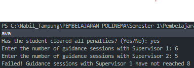
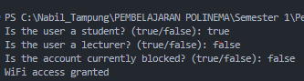
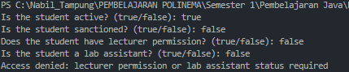

# JOBSHEET 6 - SELECTION STATEMENTS 2

**Identitas Mahasiswa:**

- **Nama:** M. Syailendra Nabil Destama
- **NIM:** 264107020208
- **Kelas / No. Presensi:** TI-1I / 18

---

## 1: TUJUAN PRAKTIKUM

Tujuan dari praktikum ini adalah:

1. Mahasiswa mampu menyelesaikan permasalahan dan studi kasus menggunakan pernyataan seleksi bersarang (nested).
2. Mahasiswa mampu menerapkan pernyataan seleksi bersarang (nested) pada program Java.
3. Mahasiswa mampu menerapkan operator logika `&&`, `||`, dan `!` pada struktur seleksi.

---

## 2: HASIL PERCOBAAN & ANALISIS

### 2.1 Percobaan 1: Nested IF untuk Memeriksa Persyaratan Ujian Skripsi

Seorang mahasiswa ingin mendaftar ujian skripsi. Sistem terlebih dahulu memeriksa bahwa mahasiswa tidak memiliki tanggungan atau denda. Jika terpenuhi, sistem memeriksa catatan bimbingan: minimal 8 kali bimbingan dengan Pembimbing 1 dan minimal 4 kali bimbingan dengan Pembimbing 2. Jika ada persyaratan yang tidak terpenuhi, sistem menampilkan alasannya.

#### 2.1.1 Kode Program Java

```java
import java.util.Scanner;

public class NestedThesisExamAttendance18 {
    public static void main(String[] args) {
        Scanner sc = new Scanner(System.in);
        String message;

        System.out.print("Apakah mahasiswa sudah bebas dari semua tanggungan? (Ya/Tidak): ");
        String noPenalty = sc.nextLine().trim();

        System.out.print("Masukkan jumlah bimbingan dengan Pembimbing 1: ");
        int guidanceCount1 = sc.nextInt();
        System.out.print("Masukkan jumlah bimbingan dengan Pembimbing 2: ");
        int guidanceCount2 = sc.nextInt();

        if (noPenalty.equalsIgnoreCase("Ya")) {
            if (guidanceCount1 >= 8 && guidanceCount2 >= 4) {
                message = "Semua persyaratan terpenuhi. Mahasiswa dapat mendaftar ujian skripsi";
            } else if (guidanceCount1 < 8 && guidanceCount2 < 4) {
                message = "Gagal! Bimbingan dengan Pembimbing 1 kurang dari 8 dan Pembimbing 2 kurang dari 4";
            } else if (guidanceCount1 < 8) {
                message = "Gagal! Bimbingan dengan Pembimbing 1 belum mencapai 8";
            } else {
                message = "Gagal! Bimbingan dengan Pembimbing 2 belum mencapai 4";
            }
        } else {
            message = "Gagal! Mahasiswa masih memiliki tanggungan";
        }
        System.out.println(message);
    }
}
```

#### 2.1.2 Hasil Running / Screenshot Output

Output yang dihasilkan program dengan masukan dari jobsheet (langkah 8):



#### 2.1.3 Tabel Pengujian Parameter Output

Hasil pengujian yang mencakup setiap kemungkinan cabang (Valid = output sesuai dengan hasil yang diharapkan):

| No | Input Parameter | Output yang Dihasilkan | Status Eksekusi |
|---|---|---|---|
| 1 | `ya, 9, 5` | "Semua persyaratan terpenuhi. Mahasiswa dapat mendaftar ujian skripsi" | Valid |
| 2 | `ya, 5, 2` | "Gagal! Bimbingan dengan Pembimbing 1 kurang dari 8 dan Pembimbing 2 kurang dari 4" | Valid |
| 3 | `ya, 6, 5` | "Gagal! Bimbingan dengan Pembimbing 1 belum mencapai 8" | Valid |
| 4 | `ya, 9, 2` | "Gagal! Bimbingan dengan Pembimbing 2 belum mencapai 4" | Valid |
| 5 | `Tidak, 9, 5` | "Gagal! Mahasiswa masih memiliki tanggungan" | Valid |

#### 2.1.4 Jawaban Pertanyaan / Pertanyaan Refleksi

- **Pertanyaan 1:** Apa yang terjadi jika mahasiswa menjawab "Tidak" pada pertanyaan bebas tanggungan? Mengapa?
  * **Jawab:** Kondisi `noPenalty.equalsIgnoreCase("Ya")` menjadi false, sehingga program melewati IF bagian dalam dan menjalankan blok `else` terluar. Program mencetak "Gagal! Mahasiswa masih memiliki tanggungan". Jumlah bimbingan tidak pernah diperiksa, karena persyaratan administrasi merupakan tingkat pertama dan harus dipenuhi sebelum hal lain dievaluasi.
- **Pertanyaan 2:** Jelaskan arti dari `if (guidanceCount1 >= 8 && guidanceCount2 >= 4) {`.
  * **Jawab:** Kondisi ini bernilai true hanya jika mahasiswa memiliki minimal 8 kali bimbingan dengan Pembimbing 1 **dan** minimal 4 kali bimbingan dengan Pembimbing 2. Operator `&&` (AND) mengharuskan kedua perbandingan bernilai true. Jika salah satunya false, seluruh kondisi menjadi false dan program berpindah ke `else if` berikutnya.
- **Pertanyaan 3:** Jelaskan alur lengkap pemeriksaan persyaratan mahasiswa dari awal sampai akhir.
  * **Jawab:** Alurnya berjalan langkah demi langkah sebagai berikut:
    1. Program membaca status tanggungan, kemudian dua jumlah bimbingan.
    2. Tingkat pertama: jika status tanggungan "Ya" (huruf besar/kecil diabaikan), lanjut ke pemeriksaan bimbingan. Jika tidak, cetak pesan masih ada tanggungan lalu selesai.
    3. Tingkat kedua: jika `guidanceCount1 >= 8 && guidanceCount2 >= 4`, cetak bahwa semua persyaratan terpenuhi.
    4. Jika tidak, dan `guidanceCount1 < 8 && guidanceCount2 < 4`, kedua pembimbing belum cukup, sehingga pesan tersebut dicetak.
    5. Jika tidak, dan `guidanceCount1 < 8`, hanya Pembimbing 1 yang belum cukup, sehingga pesan tersebut dicetak.
    6. Jika tidak, berarti hanya Pembimbing 2 yang belum cukup (Pembimbing 1 sudah mencapai 8), sehingga pesan tersebut dicetak.
    7. Pesan yang tersimpan dicetak dengan `System.out.println(message)`.

---

### 2.2 Percobaan 2: Operator Logika untuk Menentukan Akses WiFi Kampus

WiFi kampus dapat digunakan oleh mahasiswa atau dosen yang akunnya tidak diblokir. Akses diberikan jika pengguna adalah mahasiswa atau dosen, **dan** akunnya tidak diblokir. Percobaan ini melatih operator logika `&&` (AND), `||` (OR), dan `!` (NOT).

#### 2.2.1 Kode Program Java

```java
import java.util.Scanner;

public class LogicalOperatorWifiAttendance18 {
    public static void main(String[] args) {
        Scanner sc = new Scanner(System.in);
        boolean isStudent;
        boolean isLecturer;
        boolean isBlocked;

        System.out.print("Apakah pengguna adalah mahasiswa? (true/false): ");
        isStudent = sc.nextBoolean();
        System.out.print("Apakah pengguna adalah dosen? (true/false): ");
        isLecturer = sc.nextBoolean();
        System.out.print("Apakah akun sedang diblokir? (true/false): ");
        isBlocked = sc.nextBoolean();

        if ((isStudent || isLecturer) && !isBlocked) {
            System.out.println("Akses WiFi diberikan");
        } else {
            System.out.println("Akses WiFi ditolak");
        }
    }
}
```

#### 2.2.2 Hasil Running / Screenshot Output

Contoh hasil eksekusi (Pengujian 1):



#### 2.2.3 Tabel Pengujian Parameter Output

| No | Input Parameter | Output yang Dihasilkan | Status Eksekusi |
|---|---|---|---|
| 1 | `isStudent = true, isLecturer = false, isBlocked = false` | "Akses WiFi diberikan" | Valid |
| 2 | `isStudent = false, isLecturer = true, isBlocked = false` | "Akses WiFi diberikan" | Valid |
| 3 | `isStudent = true, isLecturer = false, isBlocked = true` | "Akses WiFi ditolak" | Valid |
| 4 | `isStudent = false, isLecturer = false, isBlocked = false` | "Akses WiFi ditolak" | Valid |

#### 2.2.4 Jawaban Pertanyaan / Pertanyaan Refleksi

- **Pertanyaan 1:** Jelaskan fungsi operator `||`, `&&`, dan `!` pada kondisi di atas.
  * **Jawab:** `||` (OR) bernilai true jika minimal satu sisi bernilai true, sehingga pengguna cukup menjadi mahasiswa atau dosen. `&&` (AND) bernilai true hanya jika kedua sisi bernilai true, sehingga pengguna harus menjadi mahasiswa/dosen **dan** memiliki akun yang tidak diblokir. `!` (NOT) membalik nilai boolean, sehingga `!isBlocked` bernilai true ketika akun tidak diblokir.
- **Pertanyaan 2:** Mengapa dosen tetap bisa mendapatkan akses ketika `isStudent = false`?
  * **Jawab:** Karena `(isStudent || isLecturer)` menggunakan OR. Ketika `isStudent` false tetapi `isLecturer` true, ekspresi OR tetap bernilai true. Jika akun tidak diblokir, `!isBlocked` juga bernilai true, sehingga seluruh kondisi bernilai true (lihat Pengujian 2).
- **Pertanyaan 3:** Ubah `||` menjadi `&&`. Jalankan kembali program dengan data uji 1 dan 2. Apa yang terjadi, dan mengapa?
  * **Jawab:** Kondisi menjadi `(isStudent && isLecturer) && !isBlocked`. Pada Pengujian 1 (true, false, false) dan Pengujian 2 (false, true, false), hasilnya berubah menjadi "Akses WiFi ditolak", karena pengguna harus menjadi mahasiswa **dan** dosen sekaligus, sedangkan pada kedua pengujian hanya salah satu yang bernilai true.
- **Pertanyaan 4:** Pada ekspresi `isStudent || isLecturer`, kapan `isLecturer` tidak perlu dievaluasi?
  * **Jawab:** Ketika `isStudent` bernilai true. Dengan short-circuit evaluation, `||` berhenti begitu sisi kiri bernilai true, karena hasilnya pasti true apa pun nilai `isLecturer`. Sisi kanan hanya dievaluasi ketika `isStudent` bernilai false.
- **Pertanyaan 5:** Pada ekspresi `(isStudent || isLecturer) && !isBlocked`, kapan `!isBlocked` tidak perlu dievaluasi?
  * **Jawab:** Ketika `(isStudent || isLecturer)` bernilai false, artinya pengguna bukan mahasiswa maupun dosen. Dengan short-circuit evaluation, `&&` berhenti begitu sisi kiri bernilai false, karena hasilnya pasti false tanpa memandang `!isBlocked`.

---

### 2.3 Percobaan 3: Nested IF dan Operator Logika untuk Menentukan Akses Laboratorium

Seorang mahasiswa boleh menggunakan laboratorium di luar jam kuliah jika statusnya aktif dan tidak sedang terkena sanksi. Jika terpenuhi, akses diberikan apabila mahasiswa memiliki izin dosen atau merupakan asisten laboratorium. Kasus ini menggabungkan seleksi bersarang dengan operator logika.

#### 2.3.1 Kode Program Java

```java
import java.util.Scanner;

public class NestedLabAccessAttendance18 {
    public static void main(String[] args) {
        Scanner sc = new Scanner(System.in);
        boolean isActiveStudent;
        boolean isSanctioned;
        boolean hasLecturerPermit;
        boolean isLabAssistant;

        System.out.print("Apakah mahasiswa aktif? (true/false): ");
        isActiveStudent = sc.nextBoolean();
        System.out.print("Apakah mahasiswa terkena sanksi? (true/false): ");
        isSanctioned = sc.nextBoolean();
        System.out.print("Apakah mahasiswa memiliki izin dosen? (true/false): ");
        hasLecturerPermit = sc.nextBoolean();
        System.out.print("Apakah mahasiswa adalah asisten laboratorium? (true/false): ");
        isLabAssistant = sc.nextBoolean();

        if (isActiveStudent && !isSanctioned) {
            if (hasLecturerPermit || isLabAssistant) {
                System.out.println("Akses laboratorium diberikan");
            } else {
                System.out.println("Akses ditolak: diperlukan izin dosen atau status asisten laboratorium");
            }
        } else {
            System.out.println("Akses ditolak: status mahasiswa tidak memenuhi persyaratan");
        }
    }
}
```

#### 2.3.2 Hasil Running / Screenshot Output

Contoh hasil eksekusi (akses ditolak pada tingkat kedua):



#### 2.3.3 Tabel Pengujian Parameter Output

| No | Input Parameter | Output yang Dihasilkan | Status Eksekusi |
|---|---|---|---|
| 1 | `isActiveStudent = true, isSanctioned = false, hasLecturerPermit = true, isLabAssistant = false` | "Akses laboratorium diberikan" | Valid |
| 2 | `isActiveStudent = true, isSanctioned = false, hasLecturerPermit = false, isLabAssistant = true` | "Akses laboratorium diberikan" | Valid |
| 3 | `isActiveStudent = true, isSanctioned = false, hasLecturerPermit = false, isLabAssistant = false` | "Akses ditolak: diperlukan izin dosen atau status asisten laboratorium" | Valid |
| 4 | `isActiveStudent = false, isSanctioned = false, hasLecturerPermit = true, isLabAssistant = true` | "Akses ditolak: status mahasiswa tidak memenuhi persyaratan" | Valid |
| 5 | `isActiveStudent = true, isSanctioned = true, hasLecturerPermit = true, isLabAssistant = true` | "Akses ditolak: status mahasiswa tidak memenuhi persyaratan" | Valid |

#### 2.3.4 Jawaban Pertanyaan / Pertanyaan Refleksi

- **Pertanyaan 1:** Mengapa pemeriksaan `hasLecturerPermit || isLabAssistant` ditempatkan di dalam IF pertama?
  * **Jawab:** Pemeriksaan tersebut hanya bermakna bagi mahasiswa yang sudah lolos persyaratan dasar (aktif dan tidak terkena sanksi). Mahasiswa yang gagal pada pemeriksaan pertama harus ditolak apa pun izinnya, sehingga tidak ada alasan untuk mengevaluasi pemeriksaan kedua bagi mereka.
- **Pertanyaan 2:** Jelaskan fungsi operator `&&`, `||`, dan `!` pada program ini.
  * **Jawab:** `&&` menggabungkan dua persyaratan pada IF pertama: mahasiswa harus aktif **dan** tidak terkena sanksi. `!` membalik `isSanctioned`, sehingga `!isSanctioned` bernilai true ketika mahasiswa tidak memiliki sanksi. `||` pada IF kedua memberikan akses ketika minimal salah satu dari `hasLecturerPermit` atau `isLabAssistant` bernilai true.
- **Pertanyaan 3:** Dapatkah persyaratan akses ditulis sebagai satu kondisi: `isActiveStudent && !isSanctioned && (hasLecturerPermit || isLabAssistant)`? Jelaskan apakah keputusan akses akhir tetap sama.
  * **Jawab:** Bisa. Keputusan akhir (diberikan atau ditolak) tetap sama persis, karena akses hanya diberikan ketika ketiga bagian bernilai true. Bedanya, satu IF hanya memiliki satu `else`, sehingga tidak dapat memberi tahu pengguna persyaratan mana yang gagal.
- **Pertanyaan 4:** Apa keuntungan menggunakan Nested IF pada kasus ini dibandingkan satu IF, jika sistem perlu menampilkan alasan penolakan yang berbeda?
  * **Jawab:** Nested IF memisahkan pemeriksaan menjadi beberapa tingkat, dan setiap tingkat memiliki blok `else` sendiri. Hal ini memungkinkan program mencetak alasan yang spesifik: "status mahasiswa tidak memenuhi persyaratan" pada tingkat pertama, atau "diperlukan izin dosen atau status asisten laboratorium" pada tingkat kedua. Kode juga lebih mudah dibaca dan dikembangkan.
- **Pertanyaan 5:** Buatlah satu kombinasi input yang menyebabkan akses ditolak pada tingkat pertama, dan satu yang menyebabkan akses ditolak pada tingkat kedua.
  * **Jawab:** **Tingkat pertama:** `isActiveStudent = true, isSanctioned = true, hasLecturerPermit = true, isLabAssistant = true` menghasilkan "Akses ditolak: status mahasiswa tidak memenuhi persyaratan". **Tingkat kedua:** `isActiveStudent = true, isSanctioned = false, hasLecturerPermit = false, isLabAssistant = false` menghasilkan "Akses ditolak: diperlukan izin dosen atau status asisten laboratorium".

---

## 3: TUGAS MANDIRI

Tugas-tugas berikut telah diselesaikan pada Jobsheet ini:

- [x] **Tugas 1:** Sistem diskon toko buku menggunakan Nested IF dan operator logika (aturan diskon diasumsikan, lihat catatan di bawah).
- [x] **Tugas 2:** Sistem seleksi calon asisten laboratorium menggunakan seleksi bersarang dan operator logika.

### 3.1 Implementasi Kode Tugas

#### Tugas 1: Sistem Diskon Toko Buku

> **Catatan:** flowchart dari Latihan 2 Minggu 6 tidak tersedia saat laporan ini ditulis, sehingga aturan diskon di bawah ini diasumsikan. Member mendapat 20% (total >= Rp200.000), 10% (total >= Rp100.000), atau 5% (selain itu). Non-member mendapat 10%, 5%, atau 0% dengan batas yang sama. Sesuaikan kode dengan flowchart yang sebenarnya.

```java
import java.util.Scanner;

public class Task1BookstoreDiscountAttendance18 {
    public static void main(String[] args) {
        Scanner sc = new Scanner(System.in);

        System.out.print("Apakah pelanggan adalah member? (true/false): ");
        boolean isMember = sc.nextBoolean();
        System.out.print("Total pembelian (Rp): ");
        int total = sc.nextInt();

        int discountPercent;
        if (isMember) {
            if (total >= 200000) {
                discountPercent = 20;
            } else if (total >= 100000) {
                discountPercent = 10;
            } else {
                discountPercent = 5;
            }
        } else {
            if (total >= 200000) {
                discountPercent = 10;
            } else if (total >= 100000) {
                discountPercent = 5;
            } else {
                discountPercent = 0;
            }
        }

        double discount = total * discountPercent / 100.0;
        double finalPrice = total - discount;
        System.out.println("Diskon: " + discountPercent + "%");
        System.out.println("Jumlah diskon: Rp" + (long) discount);
        System.out.println("Total yang harus dibayar: Rp" + (long) finalPrice);
    }
}
```

Hasil pengujian:

| No | Input Parameter | Output yang Dihasilkan | Status Eksekusi |
|---|---|---|---|
| 1 | `isMember = true, total = 250000` | Diskon 20%, jumlah diskon Rp50000, total yang harus dibayar Rp200000 | Valid |
| 2 | `isMember = false, total = 150000` | Diskon 5%, jumlah diskon Rp7500, total yang harus dibayar Rp142500 | Valid |
| 3 | `isMember = false, total = 50000` | Diskon 0%, jumlah diskon Rp0, total yang harus dibayar Rp50000 | Valid |

#### Tugas 2: Seleksi Calon Asisten Laboratorium

Aturan: (a) mahasiswa harus aktif dan tidak terkena sanksi akademik; (b) mahasiswa harus memiliki nilai Dasar Pemrograman minimal 80, atau sertifikat kompetensi pemrograman; (c) mahasiswa diterima jika nilai wawancara minimal 75; (d) program menampilkan alasan jika mahasiswa gagal pada tahap mana pun.

```java
import java.util.Scanner;

public class Task2AssistantSelectionAttendance18 {
    public static void main(String[] args) {
        Scanner sc = new Scanner(System.in);

        System.out.print("Apakah mahasiswa aktif? (true/false): ");
        boolean isActive = sc.nextBoolean();
        System.out.print("Apakah mahasiswa terkena sanksi akademik? (true/false): ");
        boolean isSanctioned = sc.nextBoolean();

        if (isActive && !isSanctioned) {
            System.out.print("Nilai Dasar Pemrograman: ");
            int grade = sc.nextInt();
            System.out.print("Memiliki sertifikat kompetensi pemrograman? (true/false): ");
            boolean hasCertificate = sc.nextBoolean();

            if (grade >= 80 || hasCertificate) {
                System.out.print("Nilai wawancara: ");
                int interviewScore = sc.nextInt();

                if (interviewScore >= 75) {
                    System.out.println("Diterima sebagai asisten laboratorium");
                } else {
                    System.out.println("Tidak diterima: nilai wawancara di bawah 75");
                }
            } else {
                System.out.println("Gagal: nilai di bawah 80 dan tidak memiliki sertifikat kompetensi pemrograman");
            }
        } else {
            System.out.println("Gagal: mahasiswa tidak aktif atau terkena sanksi akademik");
        }
    }
}
```

Hasil pengujian:

| No | Input Parameter | Output yang Dihasilkan | Status Eksekusi |
|---|---|---|---|
| 1 | `active = true, sanction = false, grade = 85, certificate = false, interview = 80` | "Diterima sebagai asisten laboratorium" | Valid |
| 2 | `active = true, sanction = false, grade = 70, certificate = true, interview = 60` | "Tidak diterima: nilai wawancara di bawah 75" | Valid |
| 3 | `active = true, sanction = false, grade = 70, certificate = false` | "Gagal: nilai di bawah 80 dan tidak memiliki sertifikat kompetensi pemrograman" | Valid |
| 4 | `active = true, sanction = true` | "Gagal: mahasiswa tidak aktif atau terkena sanksi akademik" | Valid |
| 5 | `active = false, sanction = false` | "Gagal: mahasiswa tidak aktif atau terkena sanksi akademik" | Valid |

IF pertama menggunakan `&&` dengan `!` untuk memeriksa persyaratan dasar. IF kedua menggunakan `||` sehingga nilai atau sertifikat saja sudah cukup. IF ketiga memeriksa nilai wawancara. Setiap tingkat memiliki blok `else` yang mencetak alasan kegagalannya masing-masing.

---

## 4: KESIMPULAN

Nested IF memeriksa kondisi secara bertingkat, sehingga pemeriksaan berikutnya hanya dijalankan jika pemeriksaan sebelumnya terpenuhi, dan setiap tingkat dapat memberikan alasan kegagalannya sendiri. Operator `&&` mengharuskan semua kondisi bernilai true, `||` mengharuskan minimal satu, dan `!` membalik nilai boolean. Short-circuit evaluation berhenti begitu hasil sudah diketahui: `||` berhenti pada true pertama dan `&&` berhenti pada false pertama. Menggabungkan seleksi bersarang dengan operator logika membuat program lebih jelas sekaligus tetap menghasilkan pesan output yang tepat.
